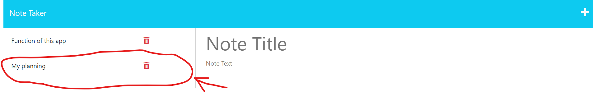

# Note-Taker App

My task is to create an application called Note Taker that can be used to write and save notes. This application will use an Express.js back end and will save and retrieve note data from a JSON file.

The application’s front end has already been created. It's your job to build the back end, connect the two, and then deploy the entire application to Heroku.

## Function of the app

- There is a landing page with a link to a notes page.
- There is a page with existing notes listed in the left-hand column.
- I can enter a new note title and the note’s text in the right-hand column.
- WHEN I enter a new note title and the note’s text, a Save icon appears in the navigation at the top of the page.
- WHEN I click on the Save icon, the new note is saved and appears in the left-hand column with the other existing notes.
- WHEN I click on an existing note in the list in the left-hand column, that note appears in the right-hand column.
- WHEN I click on the '+' icon in the navigation bar, I am presented with empty fields for note title and note’s text.

## Packages for the app

I use 'express' to create a server, which serves and handles data from the back-end; and communicates with the client side. I also use 'nodemon' to run the server.js, which will listen to any change in code and response immediately, increase the ease for development.

## Run the app

Go to the [landing](https://week11-notetaker-app-f59e0075203e.herokuapp.com/). Press 'Get Started'.

Then direct to [notes](https://week11-notetaker-app-f59e0075203e.herokuapp.com/notes). You will find existing notes are saved on the left.

When you click on the 'rubbish bin' icon on the right of each note, the note will be removed.

When you press the '+' button on the navigation bar, empty fields will appear for entering note.

When you enter both the title and text for the new note, a 'floppy disk' will appear in the navigation bar.

When you press the button, a new note will be saved and shown on the left.

